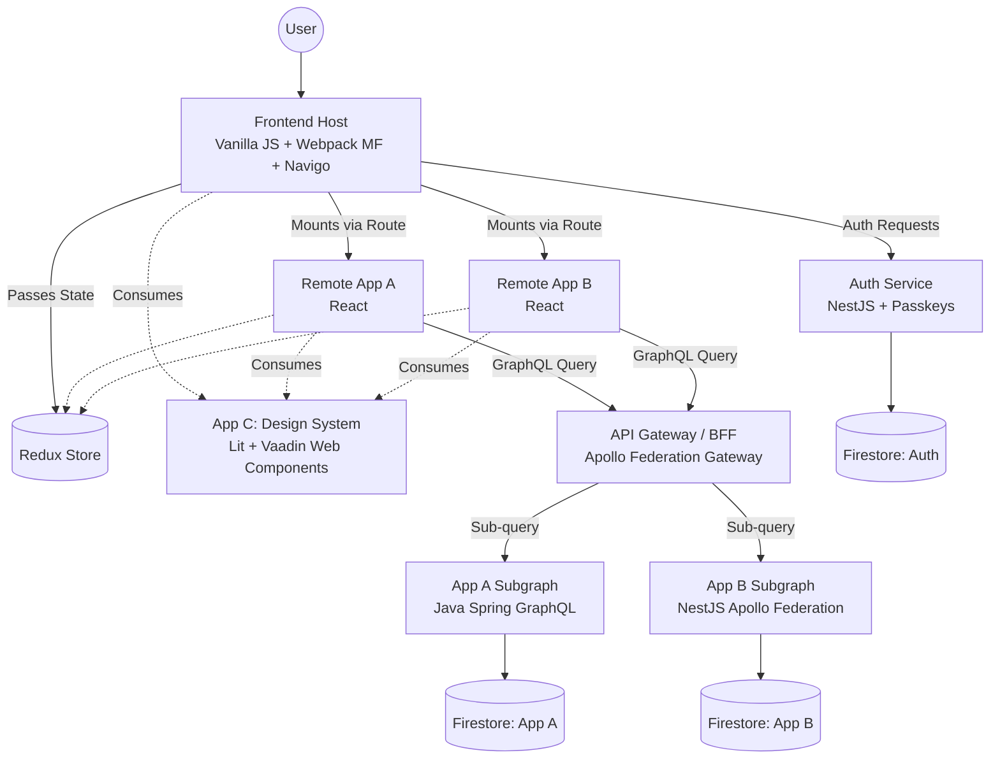

# System Architecture & Design Document

## 1. System Design Document

### High-Level Architecture
The platform is a decoupled, polyglot system designed for independent deployments and scalability. It utilizes a **Flat Micro-Frontend (MFE)** architecture on the client side, orchestrating isolated React applications within a lightweight Vanilla JS host. 

Additionally, a framework-agnostic Design System (App C) built with Web Components provides reusable UI primitives consumed by the Host, App A, and App B. It uses **Lit** to wrap and extend **Vaadin Web Components**, leveraging Vaadin's accessibility while enforcing custom branding and business logic.

On the server side, it leverages a **Backend-for-Frontend (BFF)** pattern using GraphQL Federation. This acts as a single pane of glass for the MFEs, dynamically routing and stitching together data from domain-specific subgraphs written in both Java (Spring) and Node.js (NestJS). A dedicated microservice handles modern authentication (Passkeys/JWT). 

### Data Flow Diagram

### Infrastructure Layout
*   **Local Development:** The entire platform (Host, Remotes, and Monorepo) strictly utilizes **pnpm** for package management. Orchestration is handled via **Nx** for monorepo task execution. **Docker** and **Colima** are used to spin up the API gateway, backend subgraphs, and Auth service locally. Emulators will be used for Firestore.
*   **Production (Cloud-Agnostic Deployment):**
    *   **Routing & Network (Critical):** A **Reverse Proxy / API Gateway** (e.g., Nginx, Traefik, or a CDN with rewrite rules) MUST sit in front of the architecture. It maps a single custom domain (e.g., `app.domain.com`) to the various services: routing `/` to the static frontend, `/api/graphql` to the BFF, and `/api/auth` to the Auth service. This unified domain is mandatory to ensure the `HttpOnly` cookies function correctly across the microservices.
    *   **Compute:** All backends (Auth, BFF, Subgraphs) are standard Docker containers. Note that Google Cloud Run is just the *initial target deployment*, but the architecture supports any container-hosting platform (e.g., AWS ECS, Heroku).
    *   **Frontend Assets (Host + Remotes):** Built as static assets and hosted on **Google Cloud Storage (GCS)**, served via Cloud CDN (easily portable to other storage providers).
    *   **Databases:** While Firestore is the initial target, the data layer uses generic Document DB patterns allowing swapping to MongoDB Atlas or AWS DocumentDB if needed to avoid vendor lock-in.

---

## 2. Architecture Decision Records (ADRs)

### ADR 001: Flat Micro-Frontend Architecture
*   **Context:** The application needs to support multiple independent UI modules (App A, App B). 
*   **Decision:** We will strictly enforce a flat MFE architecture where the Vanilla JS Host directly mounts all remotes. No remote application is permitted to mount another remote.
*   **Justification:** Nested MFEs exponentially increase lifecycle management complexity, dependency clashes, and tracing difficulty. A flat architecture ensures the Host remains the single source of truth for routing (Navigo) and global state (Redux Toolkit), guaranteeing predictable mounting/unmounting and isolated failure domains.

### ADR 002: GraphQL Federation via Apollo
*   **Context:** We have a polyglot backend (Java Spring and Node.js NestJS) and need a unified API for the frontend.
*   **Decision:** Implement Apollo GraphQL Federation at the API Gateway (BFF) layer.
*   **Justification:** Federation allows independent backend teams to own and deploy their subgraphs without blocking each other. The gateway automatically composes the supergraph. This eliminates the over-fetching common in REST, optimizes network payloads for the MFEs, and abstracts backend routing from the UI tier.

### ADR 003: Custom Auth Service with Passkeys
*   **Context:** The platform requires secure, modern authentication.
*   **Decision:** Build a dedicated NestJS microservice handling standard JWTs and Passkeys (via `@simplewebauthn/server`).
*   **Justification:** While managed services (like Firebase Auth or Auth0) exist, maintaining our own lightweight service offers total control over the Passkey flow, deterministic token payloads for downstream GraphQL context, and strict bounded context isolation.

---

## 3. Core Use Cases

1.  **Host Mounts App A and Passes Redux State:**
    *   **Trigger:** User navigates to `/app-a` in the browser.
    *   **Flow:** The Vanilla JS Host's Navigo router intercepts the path. It dynamically imports the remote Webpack container for App A. The Host exposes the Redux store instance to App A via props or a shared context bridge. App A (React) renders into a designated DOM node (`#root-app-a`) and can immediately read global authentication state from the Redux store.
2.  **Web Client Authenticates via Passkeys:**
    *   **Trigger:** User initiates login/registration on the Host.
    *   **Flow:** Host requests WebAuthn challenge from Auth Service. Auth Service generates a challenge. Host invokes browser biometric/passkey prompt. Host sends signed attestation/assertion back to Auth Service. Auth Service validates via `@simplewebauthn/server` and generates a JWT. **It is strictly forbidden to store the JWT in `localStorage` or Redux.** Instead, the Auth Service returns the JWT in an `HttpOnly`, `Secure` cookie. On initial app load, the Host calls an `/api/auth/session` endpoint to securely hydrate the Redux store with user profile data, keeping the actual JWT hidden from the client-side JavaScript.
3.  **BFF Federates Data Across Polyglot Subgraphs:**
    *   **Trigger:** App B executes a single GraphQL query requiring user details (from App A backend) and transactional data (from App B backend).
    *   **Flow:** App B sends the query to the Apollo BFF. The BFF's query planner detects entities spanning multiple subgraphs. It splits the query, fetching User data from the Java Spring Subgraph and Transaction data from the NestJS Subgraph concurrently, stitches the result together, and returns a single unified JSON payload to App B.

---

## 4. Testing Strategy (TDD Enforcement)

Test-Driven Development is mandated. No production logic will be committed without its accompanying test.

*   **Unit & Integration (JS/TS Backends and Frontends) - `Vitest`:**
    *   **Frontend:** Vitest will be used to test Redux reducers, utility functions in the Host, and individual isolated React components in the Remotes.
    *   **Backend (NestJS/Apollo):** Vitest will cover service-layer business logic, Apollo resolvers, and WebAuthn cryptographic utility functions.
*   **E2E and MFE Boundary Testing - `Playwright`:**
    *   Playwright tests will simulate actual user workflows. Crucially, they will test the **MFE Boundaries**—verifying that the Vanilla Host successfully loads the Webpack chunk for App A/B, routes correctly, and successfully bridges state between the Vanilla environment and the React lifecycle.
*   **Java Backend Integration - `JUnit 5 + Testcontainers`:**
    *   Integration tests for the Java Spring Subgraph will use Testcontainers to spin up ephemeral, real Firestore emulators (via Docker) before the test suite runs. This guarantees that GraphQL resolvers, Spring Data interactions, and database constraints are tested against a real environment, fully discarding the container after execution.
